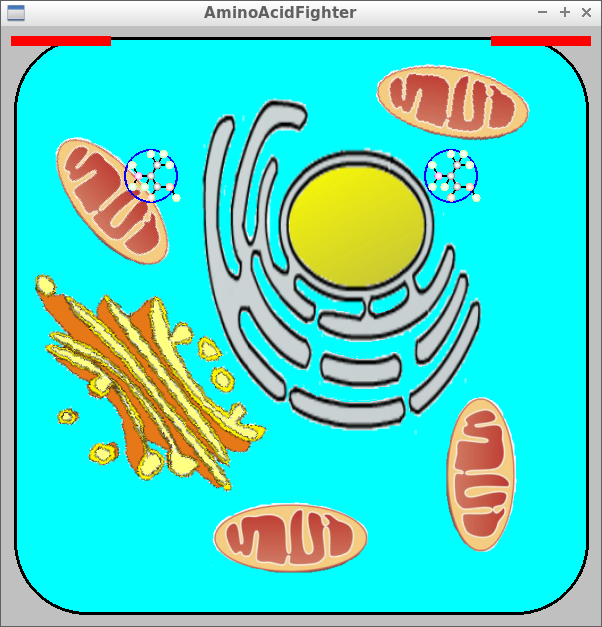
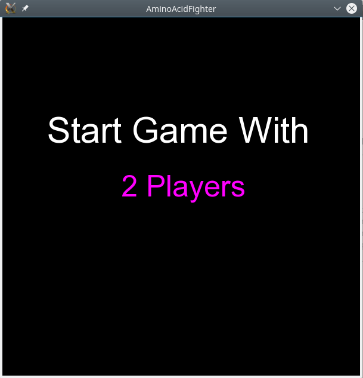
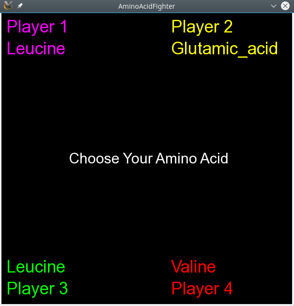
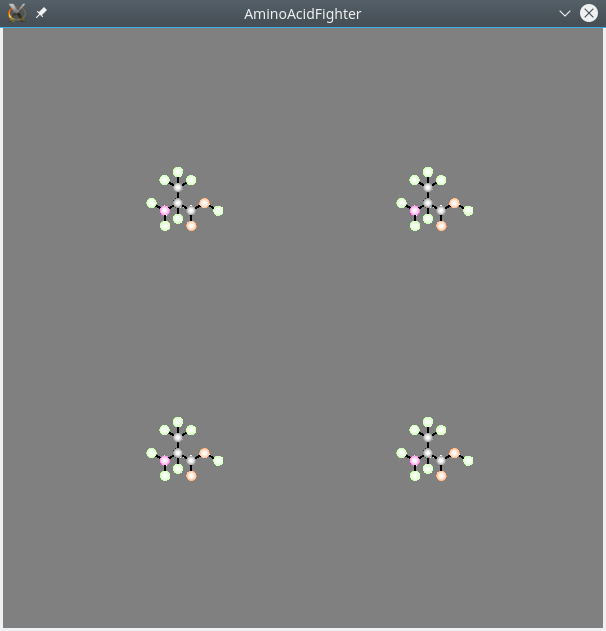

# AminoAcidFighter

Branch||
---|---|---
master||
develop||

C++ game in which amino acids do battle

## Powers

Amino acid|Power
Alanine|Cease fire (no player can shoot)
Arginine|?
Asparagine|?
Aspartic_acid|?
Cysteine|?;
Glutamic_acid|?
Glutamine|?
Glycine|Stop all bullets
Histidine|?
Isoleucine|?
Leucine|?
Lysine|?
Methionine|?
Phenylalanine|?
Proline|?
Serine|Mix speeds
Threonine|?
Tryptophan|?
Tyrosine|?
Valine|?

## Screenshots

## 2017

## 2014

